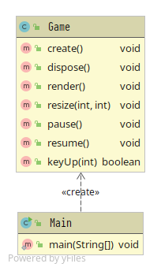

# Assignment 1 - Biblioteket

# Task 1 - Organize the team

Our groups consist of five people. Everyone studies IT, but at different levels and with different subject combinations. Our common courses are INF100, INF101 and INF102, which are the basic programming courses UIB offers. We've chosen to select roles based both on preference and experience. We chose the group name Biblioteket.

Sondre is in his third year studying computer science (Datateknologi) has a part-time job working as a developer, and therefore is experienced with software development in teams, as well as many relevant technologies such as `git` and `maven`. He is mainly responsible for the overall quality and software implementation. It will be important to him to be aware of what everyone is working on so he can coordinate properly.

Silje studies IKT at the Faculty of Social Sciences and has therefore also taken some INFO courses such as INFO100, INFO110, INFO 125 and INFO116. She also holds a bachelor's degree in business administration. Silje was assigned the role of customer contact and will be responsible for the product, in the sense that what we develop actually meets the assignment and other specifications we may choose to set. She will also be in charge of making sure we correctly implement the rules and gameplay of Robo Rally, as well as being responsible for prioritizing which features we are to include in our version of this game.

Marcus studies computer science (Datavitenskap) in his second year. He is the secretary. He will be the main person responsible for the written part of all assignments. This must also be double-checked against the correction form that belongs to each assignment. Furthermore, he will also be responsible for writing the transcripts from each meeting.

Tor-Kristian studies computer science (Datavitenskap) in his second year. He is the `libGDX` developer. As none of the group members had prior knowledge to `libGDX`, we considered it appropriate that someone took responsibility to familiarize themselves with it. This may change as we get further along in the project, for instance head of UX (user interaction). As of now, his responsibility is to finish creating the board, following the guide on MittUIB.

Tobias in his second year studying computer science (Datateknologi) was assigned the role as our test manager and will be leading the Test-driven development. His main responsibility is to make sure everyone follows good practices for TDD. This will be important to ensure the quality of our code.
For the project board, we have chosen GitHub Projects as Sondre has prior experience with this, as well as the practicality of it as it is integrated with GitHub.

# Task 2 - Overview of the expected product

## The overall goal of the application

In Robo Rally each player chooses a robot that they will use to navigate the board. To move around, one must pre-program the robot with some program cards. A number of flags are placed on the board, which the robot will have to visit. The first player to visit all the flags wins. Board elements and other robots will try to push your robot off course, which may have untold consequences.

## List of system requirements based on the high-level requirements

### Make sure the visuals work.

- Show the game board.
- Show the player.
- Show a flag.

### Be able to move around the board

- Handing out program cards.
- The player can choose program cards.
- The player can approve their choice of cards.
- Reveal program cards for each register in turn.
- A robot will move according to how it was programmed.

### Visiting flags and winning the game

- The robots are able to visit the flags.
- The game keeps track of which flags each robot has visited. (Later also show it).
- The game knows which order the flags have to be visited.
- Winning the game by visiting all the flags in the correct order.
- The game finishes when someone wins (later be prompted if they want to continue to play).

### Death

- The players can die.
- The player will die if they move out of the board.
- When all players are dead the game finishes.

### Damage

- Robots can receive damage.
- Robots die if they receive 10 damage.

### Lasers - way to take damage

- A robot being hit by a laser causes damage.
- Show board lasers.
- Board can fire lasers in a specific direction. (I think some fire two lasers)
- Robot fire lasers in the direction they are turned.

### Walls and things that stop lasers

- Show walls, they are placed between tiles.
- Walls stop robots from moving, they are not able to pass through a wall.
- Walls stop lasers.
- Robots stop lasers.

### Multiple lives and respawn

- Robots have lives. (might be adjustable at the start of the game, how many they have?)
- Robots will lose a life when they die.
- When a robot dies all the damage they have received is removed.
- Show where each robot’s archive is.
- The Archive will at first be where the robot starts the game.
- When a robot dies but still has lives left it will come back; it will respawn at its archive.
- When a robot visits a flag their archive will be moved to that flag. ( Remember to later add that it will be moved to wrench)
- Robots are allowed to share archive tile, but the robots cannot share tile.
- Robots will re-enter in the order they were destroyed.
- Repair damage - Wrenches and power down
- Show single-wrench (Cross wrench will do the same until option cards are added).
- When a robot ends a register at a wrench it places their archive there.
- If a robot ends their LAST register at single-wrench it will repair one damage.
- A player can announce their intention to go into power down the NEXT round.
- When the NEXT round starts the player will not receive any program cards, but all the damage will be removed.
- A robot in power down can still receive damage.
- At the start of the following round after a power down, the player can declare that they will stay in power down. If so \* the damage is again removed. Otherwise, they get cards.

### Locked registers

- Damaged robots get one fewer Program card for each Damage token they have.
- If a robot has 5 or more Damage tokens, its registers begin to lock up, from register 5 all the way down to register 1.
- Once a register is locked, the Program card in that register stays there until the damage locking the register is repaired.
- Being repaired will reverse the locked registers.

### Moving elements on board

- Show express conveyor belts.
- Express conveyor belts move robots two steps.
- Show normal conveyor belts.
- Normal conveyor belts move robots one step.
- Some conveyor belts make the robot rotate 90 degrees.
- Show pushers.
- Pushers shove the robots away.
- Show gears.
- Gears rotate 90 degrees.

### Adding more players and pushing robots

- Show multiple players.
- The different Program cards have a priority number.
- Higher priority number means faster movement.
- Robots can be pushed by other robots when they collide.
- Robots cannot share tile.
- Robots cannot be pushed through walls.
- Conveyor belts do not make robots push each other.

### Timer

- When the second to last player has placed their Program cards a timer goes off and the last player has 30 seconds to choose Program cards.
- Random cards are assigned the registers without Program cards.
- If all but one player is in power down then the players have 3x30 = 90 seconds to choose cards.

### Option cards

- Show cross-wrench
- Add Option cards
- If a robot ends the last register at a cross-wrench then one damage is repaired and they are assigned an Option card.
- A destroyed robot immediately loses an Option card of the player’s choice.
- a robot with an Option card can discard it to avoid receiving a Damage token

## A priority list of requirements for the first iteration’

- Show the game board.
- Show the player.
- Show a flag.

# Task 3 - Select and customize a process for the team

## Project methodology

We will be using Kanban for this project. As well as being well integrated with GitHub and GitHub projects, this provides us with a lot of flexibility. As a consequence, it will require some discipline regarding how many tasks we are working on at a time, as well as the time frame for each task.

## Developing functional and well-documented software

The team will follow the principles of test-driven development to ensure the best quality of code. Readability will be important when working together on a codebase over a long time. Relevant method and variable names, as well as javadocs where necessary will help make the code maintainable over time. Another step to ensure the quality of our code will be to have a protected master branch only available to the team lead and code review for every pull request. Regarding pair programming, this might be difficult because of varying schedules, so this is not a priority as of now. (Although not a priority we still employ this method at our in-person meetings.)
Everyone will be using Java 11, the newest version IntelliJ for writing code and JUnit 5 for testing. `Maven` will be used for continuous integration.

## Communication

We will have in-person meetings at least twice a week. As of now, we are meeting at the groups Thursdays 0915-1100 and Tuesdays 1600-1800. Outside of this, we will communicate with the team through slack

As the team lead, Sondre will ultimately be responsible for task assignment and quality of the submitted code through pull requests. No code can be merged into the develop branch without another developer reviewing and giving it a thumbs up. Together with GitHub Projects and their automation for Kanban it’s easy to get an overview of what needs to be done, what is in progress or if something has stalled. Everyone will get follow-ups and the help they require through the multiple in-person meetings as well as our Slack channel. We might also experiment with pair-programming, though scheduling might make this difficult. The first programming task, creating the board, was done in-person with everyone contributing and working together on a single computer.

# Task 4 - Code

## Scaffolding

Before the announcement and tutorial for TravisCI and Codacy were published we had already settled on GitHub Actions as our choice of CI and SonarQube for static code analysis and quality. The choice of GitHub Actions was primarily because of Sondres familiarity with them but also because of how well integrated they are with the overall product of GitHub. Both the master and develop branch has been protected from being pushed to by accident and requires a pull request to be accepted, we’ve chosen to use GitFlow for managing branches and releases. This is both a proven and easy way to separate what has been released to the customers (the last commit in master is what is currently released), how far along you’ve come (how far ahead is develop?) and individual branches for features, fixes etc.

## Project Board

Given that we’re using Kanban the flow is quite simple, issues are either in the backlog or assigned and in progress, and depending on how developed they are how far along the lanes they’ve reached. Our GitHub Project board is a board that will follow us through the development of the game, from start to finish (as we will regard this as a 1.0 release).

## User Stories

We’ve explicitly chosen to be light on details for user stories, and had we used something like Jira we’d have a single epic that issues would depend on. Instead, we will use milestones as a sort-of epic, with a single “epic” issue that lists the user stories, what the requirements and relevant details on progress etc.

## User stories

- As a user, I want to be able to see my game, as I need it to be able to play it
  - **Criteria:** Once the user starts the game they should see a new game board with the player piece in position `(0,0)`, a black hole in the middle and a flag in `(4,0)`.
- As a user, I want to be able to interact with my game so that I can use it
  - **Criteria:** After the game has started user input should be accepted, with the choice of normal computer gaming controls (e.g. `WASD` for moving). Pressing a single button moves the player piece in the given direction, barring any blocked movement.
- As a user, I expect my piece to move according to the input I give
  - **Criteria:** When giving commands to my piece I expect it to behave predictable, e.g. move in the given direction unless blocked or otherwise unable to. If the player piece reaches cells that interacts with it, it should graphically show that the piece is being interacted with. E.g. if the piece gets to the flag it should have a visible effect, same as if it reaches the hole in the middle.

## Retrospective

In the meeting on Thursday 30.01, we did a lot for the written part of the assignment together, which made sure that we knew where we were headed. A new meeting was planned for Tuesday 04.02, and everyone were given assignments. We got the project board started. This ensured that we were able to be very productive when we met again Tuesday.
On Tuesday Tor-Kristian gave a presentation on `libGDX`, and Sondre gave a presentation on `git`, going over gitignore, pull requests, code review, project board, branches, merges, merge conflicts. The rest of the day was spent going through the libGDX guide on MittUIB together, because of this the spread of commits is not very even between members of the group.
So far everything has been working very well in the team. It will be important to continue to focus on our communication so no one is left behind as we move forward with this project.

## Regarding testing

So far, all of our code is based on the guide on LibGDX and tiled posted to MittUiB. We feel like this should be sufficinet because it answers the entire coding part of the first assignment, and we would rather spend the time working on the written part of the assignment.
A consequence of this is that we dont have anything to test. We only have the Main and Game classes, and we dont know how write tests using the LibGDX framework.
When we start working more on the logic of the game, testing will be an important part of our development process.

## UML

## Transcripts

All transcripts are listed by date at our wiki.

- [Transcripts Thursday 30.01](https://github.com/inf112-v20/biblioteket/wiki/Transcript-30.01)
- [Transcripts Tuesday 04.02](https://github.com/inf112-v20/biblioteket/wiki/Transcript-04.02)
- [Transcripts Thursday 06.02](https://github.com/inf112-v20/biblioteket/wiki/Transcript-06.02)
