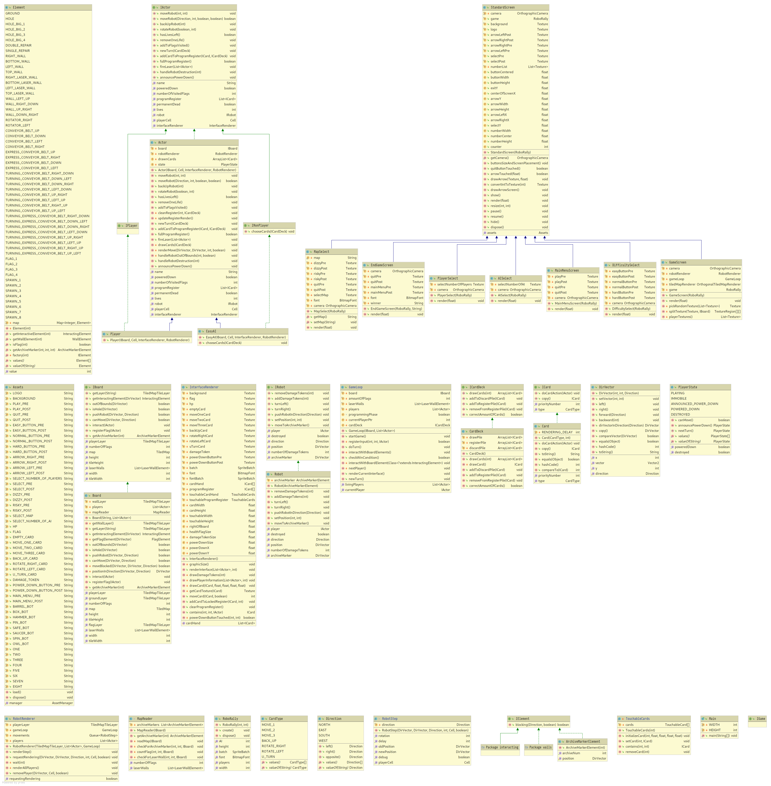
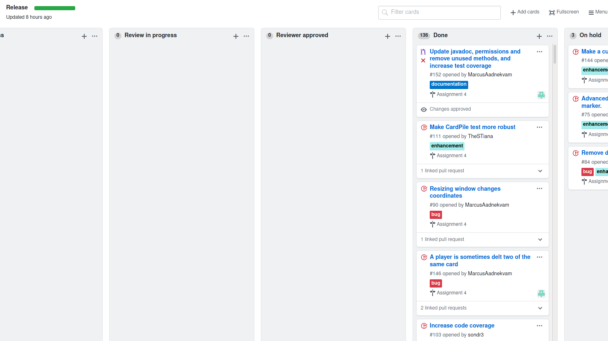
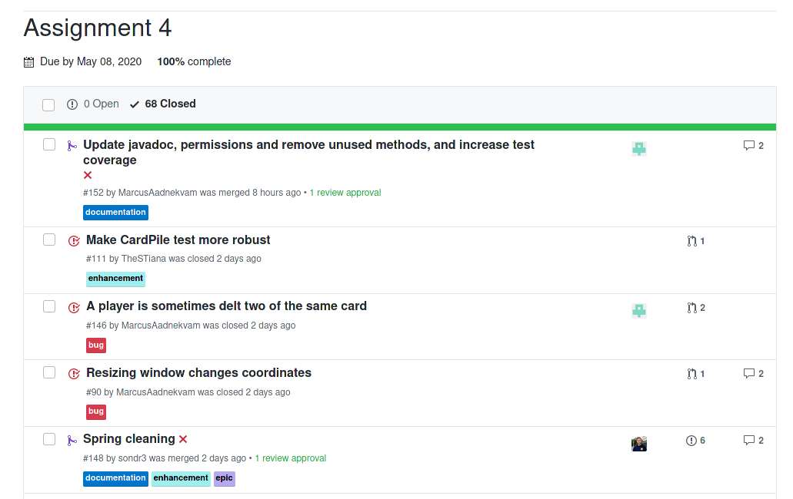

# Task 1: Team and Project

**NOTE:** For a transcript from most of our meetings where we deemed in
necessary, see our [wiki](https://github.com/inf112-v20/biblioteket/wiki).

As stated in the previous deliverable, coronavirus has pushed all of us into
somewhat of a strange "virtual learning" environment. As all of us in the group
are accustomed to attending physical education, it has been tricky to adapt to
these bizarre current norms.

Our group meets online at least twice a week. As there is no face to face
interaction anymore, it can be somewhat harder to follow what is going on, or to
explain something. Screen share serves as somewhat of a solution, although
sometimes a faulty internet connection can limit even that. Due to a lack of
face to face interaction, the meetings online must be much more structured and
are more difficult to maintain an adecquate flow, as this can easily be
interrupted by an unwelcomed noise from someone's microphone, or a disconnection
of internet. If there is a group consensus that we are lacking in some sense for
the project, this can be solved "easily" by scheduling a work period in which we
all sit on discord and work, allowing for live support from other group members
(as close as it can get to live support anyway), we also have in the past
scheduled more meetings in one week, in the case that we might be accomplishing
what we are working on in one meeting rather quickly and would like the group's
input.

Our groups adaptation to the COVID crisis, while slow and grueling (and somewhat
of a trial and error process, seeing what works and what doesn't), has swiftly
improved via our improved meeting structure, our open communication on slack and
discord, and our flexibility and willingness to work outside our assigned roles.
The reason we must be open to versatilitile tasks regarding the project, is
because we weren't sure exactly what roles were going to be in demand when we
started.

We have kept the same roles as for the previous turn in, and we are approaching
our roles with flexibility, meaning people who have a set role in one department
can also provide key developments elsewhere. Sondre is still our team lead,
while simultaneously staying on top of GitHub, this also means maintaining an
overview of the branches and the general progress on the project board. Marcus
still takes notes at the meetings, but also has been working effectively to
implement features, in parts like rendering of robots. Silje is still our
customer contact, while simultaneously taking on the role of somewhat of a
"judge", as she has mastered the rules of the game, she is able to determine
whether or not there are any rule violations happening, Silje is also
responsible for multiple positive implementations on the code. Tor Kristian has
been continuing his work on the GUI for the game, making sure that the player
has all necessary information visible to them during the gameplay (e.g.
damagetokens). For this part of the project, Tobias has undertaken the process
of drawing the playermodels, and using libGDX to pack the textures so that they
function as intended, as this wasn't a necessarily difficult task, Tobias has
also been assigned the role of writing the main written part of the delivery.

## Retrospective and choices along the bumpy road

All things considered we are happy where we ended up, though we generally agree
that there are a few things we would've done differently, some of which we
mentioned during the final presentation:

- In the beginning we might've been too strict on mandating that we followed
  TDD, where we instead should've allowed ourselves to experiment and figure
  things out by trial and error.
- TDD is hard to do correctly, especially so if it is your first introduction to
  it and both the problem domain and methodology are new.
- We should've eased on giving individuals tasks that ended up becoming very
  large changes and instead attempted to divide things into smaller parts. It
  became hard to follow along the development because very large changes would
  happen on the `develop` branch while you were working on yours.
- Doing more pair programming our group programming might've helped in the
  beginning, but we had a hard time scheduling our meetings already and decided
  that as a group we couldn't mandate it but we were open for it.

### Progress

We spent a fair bit of time getting of the ground, in part because this was a
big undertaking and we didn't have a good angle of attack from the get go. We
also decided partway through assignment 3 to rewrite the representation of the
board by letting both Marcus and Sondre create their own perceived best solution
and then as a group decided on the best solution (which ended up being a
combination of both projects). This was in many ways _the_ hurdle, once we got
past this the pace improved rapidly, as can be seen from the frequency of PRs
opened along the way.

Considering the current impact of the COVID-19 outbreak, we have adapted
quickly, with a near frictionless switch to online meetings rather than our
prior face to face meetings. Another practice we maintained that has benefitted
us greatly, is having diverse roles for the team, while also being flexible
about what we work on. Also, we have had good communication on Slack and
Discord, which heavily furthered our ability to eliminate problems we had during
development. One thing we agreed we would do differently if we could start over
with the knowledge we have now, is to find a good solution for the grid earlier
on.

## Group dynamics, communication, quarantine

The group dynamic now is significantly improved relative to the one we had at
the start, as we all have roles which complement eachother, as we have had time
to try different roles. Our communication has been good, although it was
somewhat deterred when we could no longer have meetings on campus, our discord
meetings are still progressive towards our completion of the project, as we all
try to compile an agenda, with questions, comments, and concerns prior to each
meeting. During the actual meetings, we take turns one by one to explain what
we've been working on, the status of it, and if there are any problems regarding
it. The impact of the quarantine/lockdown initially seemed as though it would
reduce the pace at which the game was developing, it has had a considerably
smaller impact than expected. Our first online group meeting was on zoom, but we
were quick to switch to discord, so that we might include a teacher's assistant
in the meetings. We also have adapted to cooperating without face to face
interaction entirely, as some group members don't have access to a suitable
webcam or are uncomfortable with using it. If push came to shove, and we felt
our progress rate was sub par, there was always the option of potentially
setting up a work time of a few hours to cooperate on Discord so that problems
may be brought up with the group with instantaneous available assistance, rather
than waiting for a slack response or a meeting.

- Our group dynamic has significantly improved, as we all have assigned roles
  which complement each other but are also flexible enough with our roles to
  take on issues and challenges outside of our roles field of work.
- Communication: Although we are no longer meeting face to face because of
  coronavirus, our discord meetings are still proactive, as people try to
  prepare questions, concerns, and ideas into a list before the meetings, and
  then we go one by one to discuss what we’re working on, how it’s going with
  that, and what we are planning.
- Quarantine/lockdown and the impact thereof on the team.
  - We talked a bit about this in the previous delivery, not much has changed
    since then
  - Our first online group session was zoom
  - Switched to discord to include TA
  - Must adapt to cooperation without face to face interaction, as some group
    members do not have an accessible webcam or are uncomfortable video calling.
- Adapting to quarantine:
  - Preparing personal agendas for discord meetings
  - Potentially setting up a work time of a few hours to cooperate on discord so
    that problems may be brought up to the group instantly, rather than having
    to wait on a meeting either Tuesday or Thursday.

# Task 2: Requirements

## UML Diagram

This is the "small" UML class diagram for our project, we have also included a
diagram that also shows the dependencies between the various classes, interfaces
and enums but it is gigantic, see `uml4-large.png`.

.

## GitHub milestones and project board

The project has been developed and planned using a Kanban project board on
GitHub with milestones for each of the assignments, making keeping track of what
has been done a breeze. Issues are assigned labels and assigned to whoever is
responsible. See the following images for a preview, you can also visit the
[final milestone](https://github.com/inf112-v20/biblioteket/milestone/4) and the
[project board](https://github.com/inf112-v20/biblioteket/projects/1).

## User stories

- As a user I expect to be able to see where the robots are moving
  - Currently the robots simply move from A to B using the movement in the cards
    without animating how they ended up at their location making it confusing
    and difficult to track what they interacted along the way.
  - **Criteria:** The game should implement a way to animate the robot along the
    path they take. Care needs to be taken to ensure that the robots move in a
    consistent manner, follows the cards, their priority and interactions with
    the environment into account.
- As a user I expect to be able to see each cards priority prior to selection
  - The game should display in the GUI the priority for each card, enabling them
    to make the correct choices and not have the robot move in a surprising
    manner (i.e. not in the order of the cards chosen).
  - **Criteria:** Each card should show its priority.
- As a user I expect my robot to be able to push other robots around
  - An important part of the game is being able to predict the path other robots
    are taking and outsmart them by pushing them into obstacles.
  - **Criteria:** Two robots colliding should be pushed in the expected
    direction, i.e. two colliding head one would result in neither moving while
    being hit from the side would push the robot in the direction the attacker
    hit it from.
- As a user I expect the game to maintain it’s current functionality when
  resizing the window.
  - The game should be resizable, and maintain all functionality no matter what
    resolution the window is resized to.
  - **Criteria:** The player’s mouse clicks should register correctly regardless
    of the size of the game window, within reasonable limits. E.g. if the user
    makes the window so small we cannot meaningfully show everything it's their
    prerogative but also their problem.
- As a user I expect my robot to fall down holes or off the map if a move I have
  made pushes them off.
  - Robots should be able to fall through holes and off the map if pushed. We
    need to make sure that the game loop properly detects robots falling into
    holes or outside the map regardless of whether it was intentional or
    happened along the planned route.
  - **Criteria:** A player should fall through a hole or off the map if their
    robots movements lead them to do so.
- As a player I expect to be able to play with other players and/or AI
  - As fun as the game is in singleplayer, it is even more so in multiplayer. We
    need to implement a way so that the player can play with multiple enemies.
    For this task we require a few subtasks:
    - The game should have a way to select the amount of players and AI
    - The game should have a way for the player to select the AI difficulty
    - The game should have a way for the player to select a map
  - **Criteria:** The game requires the specified game screens mentioned that
    hook into the underlying `RoboRally` game for getting and setting the
    correct map, number of players etc.
- As a player I expect there to be lasers
  - A key part of the game is attempting to avoid lasers being fired by laser
    walls and other robots.
  - **Criteria:** This needs to be implemented so that they fire when they
    should throughout each round, that the laser shot itself is blocked
    correctly by entities, that hits are registered correctly and so on.
- As a player I expect that I can see the difference between the various players
  - **Criteria:** We need several different sprites for the robots so that you
    can distinguish between your robot and all the other players'.
- As a player I expect that the GUI provides the necessary information
  - The game should display the players health and flag score, their robots
    hitpoints, cards selected and cards in their deck and have a power down
    button.
  - **Criteria:** Each player has an associated health pool, a count of the
    flags they have visited, their robots health and power down status. These
    needs to be "hooked" up to the GUI so to speak so that one can see your and
    the other players statuses. The name of the current player should be
    highlighted so that it is always clear whose turn it is and players who have
    decided to power down needs to be distinguished in a good way.
- As a player I expect there to be an end-of-game screen to display the winner
  - **Criteria:** Once a winner has been declared the game should transition to
    a end of game screen displaying the name of the winner instead of just
    outright exiting the application.

## Developer stories

As with the previous assignments, some tasks are back-end related and therefore
not strictly user stories but stories that we need to get things working behind
the scenes.

- **Criteria:** We need a game loop that is responsible for the core loop of the
  game; the players should be able to pick their own cards while the robots
  should draw automatically, the robots should move according to their
  programmed cards and interact with the environment.
  - We need to ensure that the robots move in the correct order with their
    prioritized cards, that their movement happen in the correct order,
    interacting with elements happen correctly (i.e. express conveyor belts move
    once before regular conveyor belts).
  - Damage taken should be accounted for in the selection of cards, and cards
    should be properly discarded once selected.
- **Criteria:** We need to update and add JavaDocs to all methods that have
  documentation that are either out of date or fix the ones that are missing
  parameters, returns etc.
- **Criteria:** We also need to remove unused code from the codebase, this
  should be fairly straight forward thanks to the analytics provided by IntelliJ
  IDEA.

## Bugs

- The code for handling clicking buttons is fairly sensitive to resizing the
  window due to the math required to figure out their relative location.
  Resizing works but the hitbox for cards for example might become slightly out
  of sync with what as a player see.
- The laser robots fire is currently invisible and it is therefore quite tricky
  to figure out whether you are hit, will be hit etc without looking at the game
  logs.

## Testing

We have code testing the most important parts of the code by running the game as
a headless application, making it possible to be sure that interactions happen
the way they should because we are actually _playing_ the game during the tests,
not just simply testing behavior (though we have tests for that too). For the
manual testing see the ManualTests.md file in the test folder.
